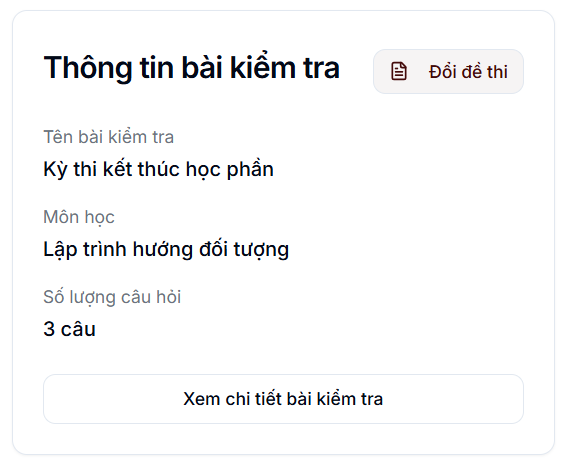
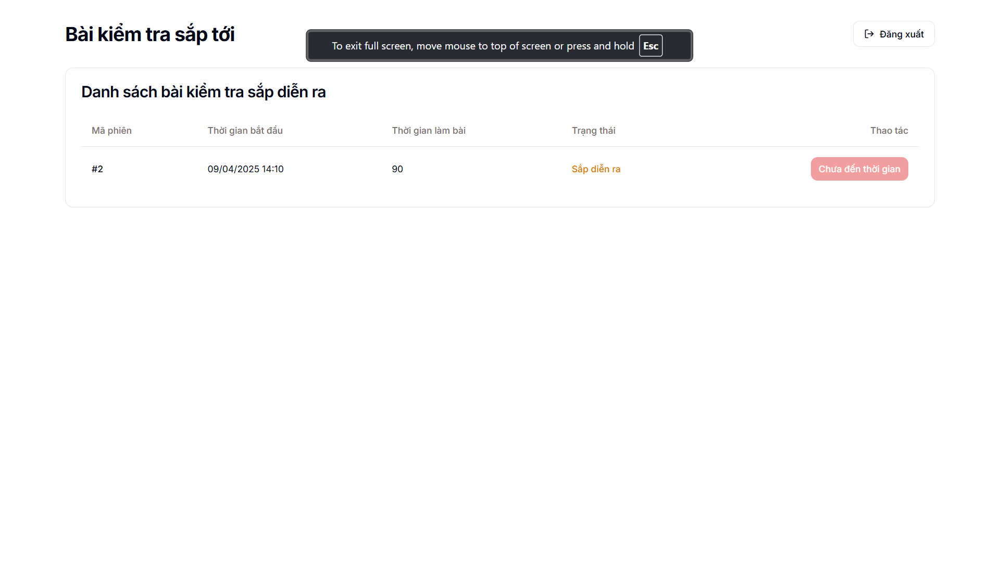

# Hướng dẫn sử dụng: Answergate

- [Hướng dẫn sử dụng: Answergate](#hướng-dẫn-sử-dụng-answergate)
  - [About project](#about-project)
  - [Tính năng chính](#tính-năng-chính)
  - [Luồng sử dụng](#luồng-sử-dụng)
    - [ADMIN](#admin)
    - [USER](#user)

## About project
Đây là hệ thống thi trắc nghiệm trực tuyến, hỗ trợ ra đề thi, phân chia ca thi và chấm điểm tự động và lưu trữ lịch sử làm bài.

Các công nghệ, kiến thức sử dụng:
* **Backend**: framework java Springboot
* **Frontend**: ReactJS, Vite, TypeScript
* **Database**: SQL Server

## Tính năng chính
Vai trò **USER**:
* Xem danh sách các ca thi được giao
* Vào làm bài thi khi đến thời gian
* Cập nhật bài làm, nộp bài

Vai trò **ADMIN**:
* **Quản lý danh sách user**
  * Xem danh sách user hiện tại
  * Thêm từng user
  * Nhập nhiều user bằng file excel
  * Sửa thông tin user
  * Xóa user
* **Quản lý test**
  * Xem danh sách test
  * Xem thông tin chi tiết: tên test, môn học, danh sách câu hỏi
  * Tạo test mới
  * Chỉnh sửa thông tin bài test
  * Chỉnh sửa danh sách câu hỏi
  * Xóa test
* **Quản lý ca thi**
  * Xem danh sách ca thi
  * Xem thông tin chi tiết: đề thi sử dụng, danh sách thí sinh, danh sách kết quả thi (cập nhật liên tục trong thời gian làm bài)
  * Tạo ca thi mới
  * Chỉnh sửa thông tin ca thi: thời gian bắt đầu, thời gian làm bài, bài test sử dụng, danh sách thí sinh
  * Xóa ca thi

## Luồng sử dụng
### ADMIN
* **Bước 1**: Quản trị viên đăng nhập với vai trò admin, với thông tin đăng nhập mặc định
  * **Username**: admin
  * **Password**: admin

  
* **Bước 2**: Quản lý danh sách user
  * Xem danh sách
  
  * Xem thông tin chi tiết của user: click vào **Chi tiết** ở cuối mỗi hàng
  
  * Chỉnh sửa thông tin user: trong màn hình xem chi tiết, bấm **Chỉnh sửa**
  
  * Thêm user mới: click vào button **Thêm người dùng**, nhập đầy đủ thông tin và bấm **Tạo người dùng**
    
  * Nhập danh sách user từ file excel
    * File excel phải đúng format, nếu có một dòng lỗi thì sẽ không nhập user nào từ file
        
    * Bấm vào nút **Tải lên**, sau đó chọn file excel có định dạng đúng như trên
        
  * Xóa user: click vào ô tròn trước mỗi hàng và bấm **Xóa**
    

* **Bước 3**: Quản lý danh sách test: 
  * **Xem danh sách đề thi**: vào admin-home -> quản lý đề thi
    
  * **Tạo đề thi mới**: click vào **tạo đề thi mới**, nhập thông tin và bấm **Lưu**
    
  * **Xem chi tiết đề thi**: click vào chi tiết ở cột **Thao tác**
    
    
  * Chỉnh sửa đề thi: trong màn hình **Xem chi tiết**, chọn **Chỉnh sửa**
    * Chỉnh sửa thông tin bài thi: ở trong tab *Thông tin chung*, nhập thông tin các trường
        
    * Chỉnh sửa danh sách câu hỏi: ở trong tab *Câu hỏi*
      * Thêm câu hỏi:
        
      * Chỉnh sửa câu hỏi:
        
      * Xóa câu hỏi:
        
      Sau khi chỉnh sửa xong tất cả thì bấm vào **Lưu thay đổi**

* **Bước 4**: Quản lý phiên thi
  * Xem danh sách phiên thi
    
  * Xem thông tin chi tiết: bấm vào **Chi tiết** ở cột **Thao tác**
    * Thông tin chung
        
    * Danh sách thí sinh
        
    * Kết quả: danh sách thể hiện tình trạng làm bài của tất cả các thí sinh
        
  * Chỉnh sửa phiên thi: bấm vào chỉnh sửa
    
    Nhập các thông tin và bấm **Cập nhật**
    
  * Chỉnh sửa đề thi:
    
    Danh sách đề thi hiện lên, bấm **Chọn** vào đề thi muốn sử dụng
        
  * Chỉnh sửa danh sách thí sinh
    * Vào tab **Thí sinh**, chọn **Thêm thí sinh**. Lúc này có 2 option: Thêm thí sinh theo loại hoặc thêm thủ công
      * Thêm thí sinh theo loại: chọn tất cả các loại mong muốn và bấm **Thêm thí sinh**
        
      * Thêm thí sinh tùy chỉnh: nhập danh sách username của các thí sinh và bấm **Thêm thí sinh**
        

### USER
* **Bước 1**: Đăng nhập
  * Username: các ký tự đầu trong họ tên + mã số ngẫu nhiên (do ADMIN cung cấp)
  * Password: ngày tháng năm sinh ở định dạng ddMMyyyy
  Ví dụ: username: nht551, password: 19102004 (sinh ngày 19/10/2004)

* **Bước 2**: Xem danh sách bài thi
  

* **Bước 3**: Làm bài thi
  * Click chọn **Vào làm bài**
    
  * Vào test-confirmation, chọn **Bắt đầu làm bài**
    
  * Xem trạng thái làm bài:
    
  * Đánh dấu: mark for review
    
  * Trả lời câu hỏi
    
  * Lưu tiến trình làm bài: rất quan trọng nếu không muốn bị mất tiến trình do các yếu tố không mong muốn (mất mạng, mất điện)
    
  * Nộp bài: nếu không nộp bài thì sau khi hết thời gian hệ thống sẽ tự động nộp